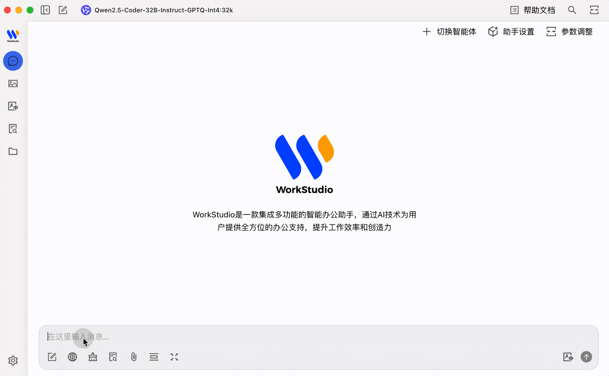
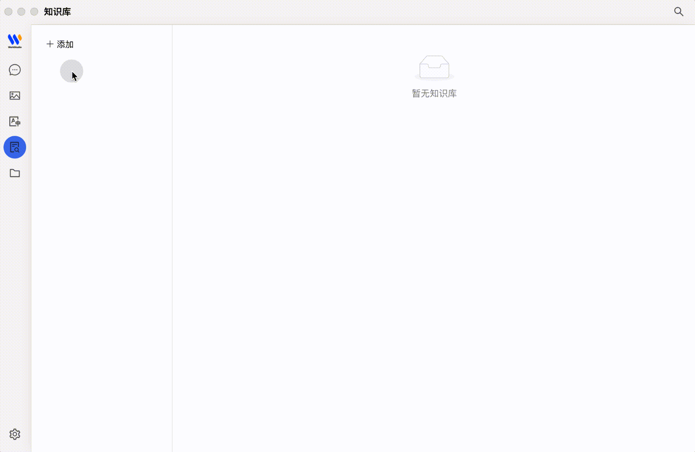
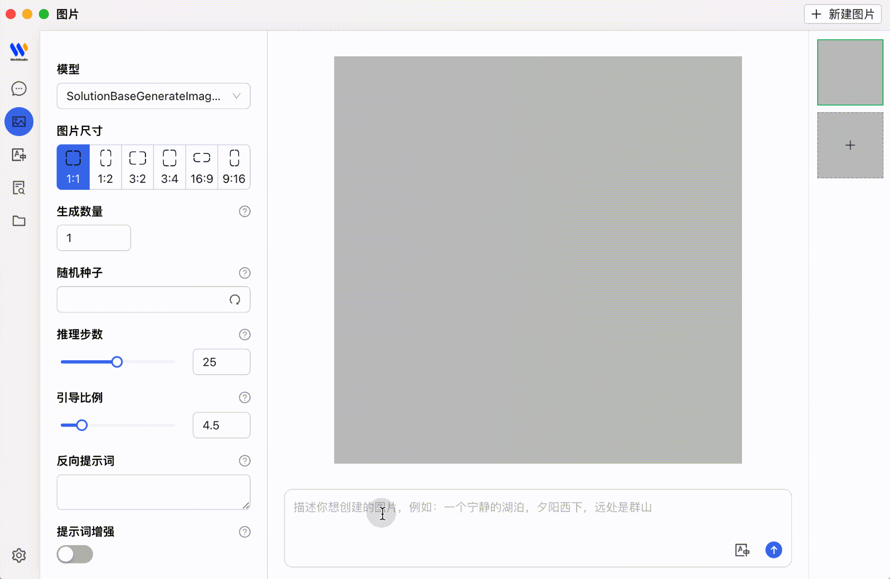

<div align="center">
  
  <h3>强大的生产力AI助手</h3>
    <div align="center">
  <a href="./README.md">English</a> | 中文 
</div>
  <div>
    <a href="https://github.com/Puhua-AI-Research/WorkStudio/stargazers">
      
    </a>
    <a href="https://github.com/Puhua-AI-Research/WorkStudio/network/members">
      
    </a>
    <a href="https://github.com/Puhua-AI-Research/WorkStudio/issues">
      
    </a>
    <a href="https://opensource.org/licenses/Apache-2.0">
      
    </a>
  </div>
  
</div>

  
## 📸 截图展示

<div align="center">
  <h4>💬 智能多模型对话</h4>
  

  <h4>⚙️ 高级模型设置</h4>
  
  
  <h4>📚 知识处理与管理</h4>
  
  
  <h4>🎨 AI图像生成</h4>
  
  
  <h4>🔤 智能翻译</h4>
  
</div>

## 🌟 核心功能


### 1. 多样化大语言模型服务支持
- 💻 通过auto_openai llm和ph8-llm支持本地模型部署
- 🔒 为企业安全和数据合规提供私有部署选项

### 2. 智能助手与对话
- 📚 内置300+预配置AI助手
- 🤖 支持创建自定义个性化助手
- 💬 多模型同时对话，提供多元视角

### 3. 文档与数据处理
- 📄 支持文本、图像、Office文档、PDF等多种格式
- ☁️ WebDAV文件管理和数据备份
- 📊 Mermaid图表可视化
- 💻 代码高亮显示

### 4. 实用工具集成
- 🔍 全局搜索功能
- 📝 话题管理系统
- 🔤 AI驱动的翻译
- 🎯 拖放排序
- 🔌 小应用支持

### 5. 优质用户体验
- 🖥️ 跨平台支持Windows、Mac和Linux
- 📦 开箱即用，无需环境设置
- 🎨 明暗主题和透明窗口支持
- 📝 完整的Markdown渲染
- 🤲 便捷的内容分享功能

## 📋 安装

- 通过提供离线安装桌面应用软件包安装即可

## 💻 开发

### 项目设置

1. 克隆仓库
   ```bash
   git clone https://github.com/Puhua-AI-Research/WorkStudio.git
   cd WorkStudio
   ```

2. 安装依赖
   ```bash
   yarn
   ```

3. 启动开发服务器
   ```bash
   yarn dev
   ```

### 构建选项

项目支持多平台构建：

#### Windows
```bash
# 构建Windows版本
yarn build:win

# 构建Windows x64版本
yarn build:win:x64
```

#### macOS
```bash
# 构建macOS通用版本
yarn build:mac

# 构建macOS ARM64版本
yarn build:mac:arm64

# 构建macOS x64版本
yarn build:mac:x64
```

#### Linux
```bash
# 构建Linux版本
yarn build:linux

# 构建Linux ARM64版本
yarn build:linux:arm64

# 构建Linux x64版本
yarn build:linux:x64
```

### 大模型支持

WorkStudio为大语言模型集成提供灵活选项：
   
- **本地部署**：使用以下工具以最少的设置在本地运行模型：
   - 使用vllm进行容器化部署
   - 使用LM Deployment进行用户友好的基于GUI的管理
   
- **ph8-llm集成**：原生支持ph8-llm，实现：
   - 高性能推理
   - 自定义模型微调
   - 参数高效适配

- **企业私有部署**：在组织基础设施内部署模型，以实现：
   - 数据隐私合规
   - 自定义模型托管
   - 与现有企业系统集成

## 🚀 私有部署

- 有关私有部署的更多信息，请加入下方我们的技术讨论群进行交流和获取支持。

## 🙏 致谢

我们衷心感谢Cherry Studio的重要贡献。WorkStudio是基于Cherry Studio产品的二次开发。

## 📄 许可证

本项目采用[Apache License 2.0](https://github.com/Puhua-AI-Research/WorkStudio/blob/main/LICENSE)许可，附加以下条款：

- **免费商业使用**：用户可以在不修改代码的情况下将软件用于商业目的
- **需要商业许可**：
  - 修改应用程序（名称、标志、代码、功能）时
  - 向拥有10个以上用户的企业客户提供多租户服务时
  - 预装或与硬件设备或产品捆绑时
  - 政府或教育机构大规模采购时

## 💬 技术讨论群

<div align="center">
  
  <p>扫描二维码加入我们的技术讨论群</p>
</div>

## ⭐ Star历史

[](https://star-history.com/#Puhua-AI-Research/WorkStudio&Timeline)

<div align="center">
  <p>由<a href="https://github.com/Puhua-AI-Research">普华AI研究院</a>用❤️制作</p>
  <p>© 2025 WorkStudio. 保留所有权利。</p>
</div>
