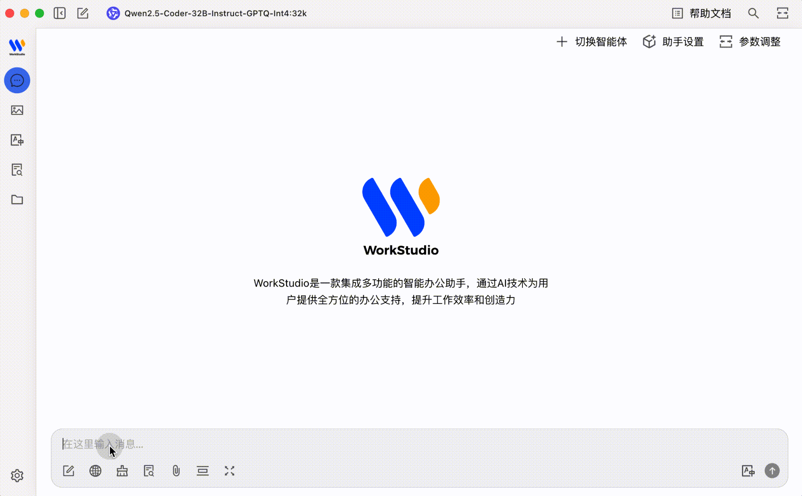
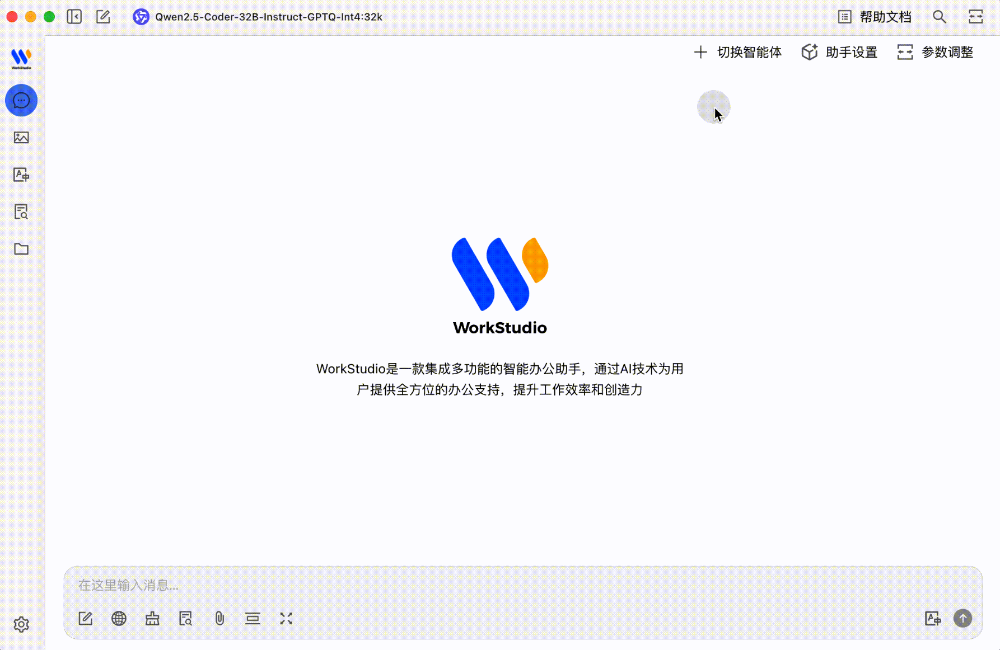
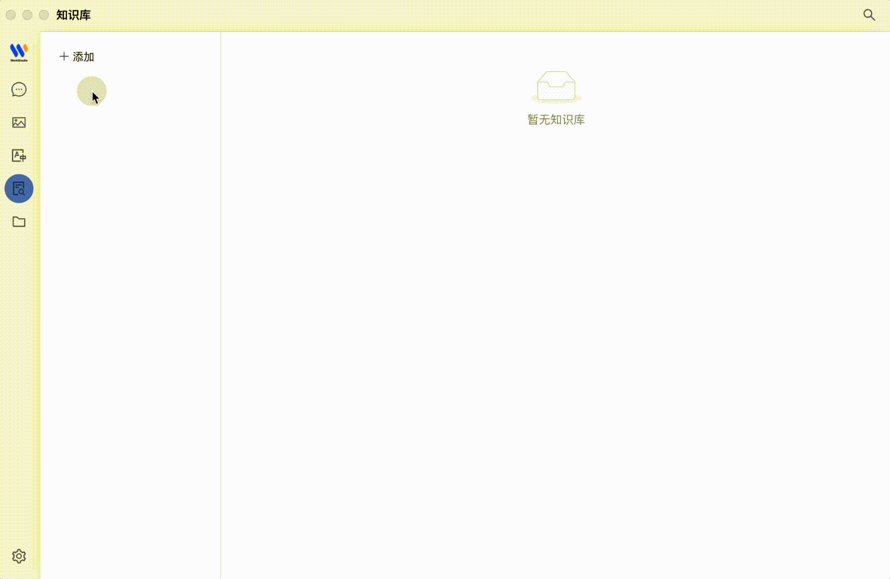
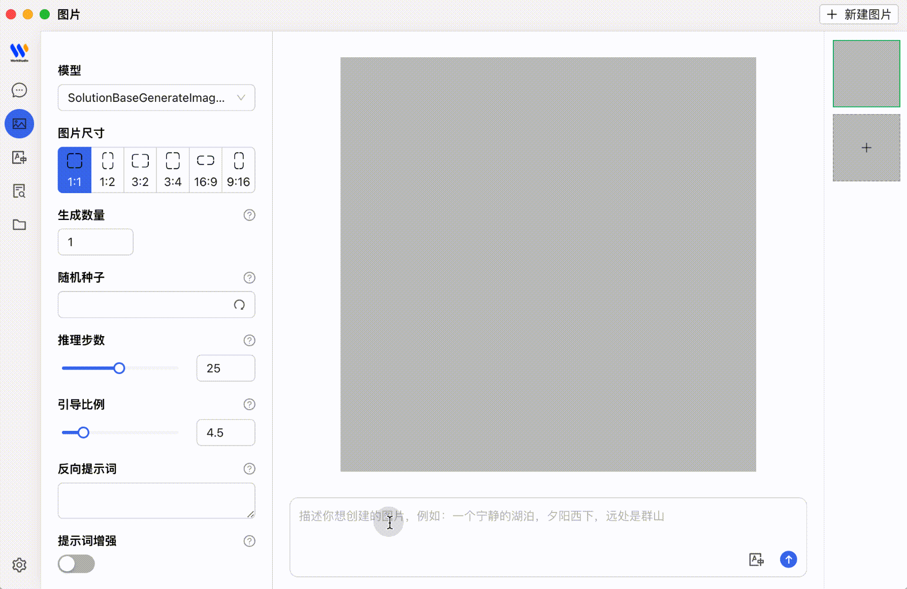
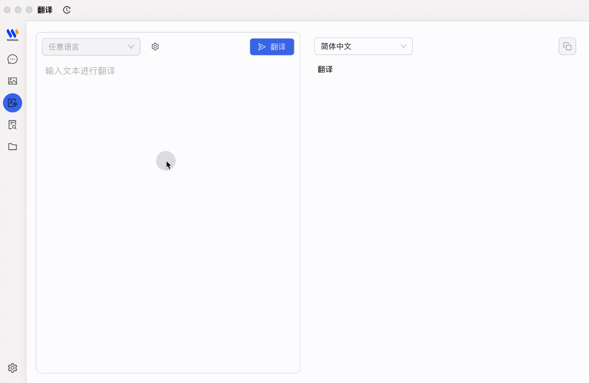

<h1 align="center">WorkStudio</h1>
<h1 align="center">
  <a href="https://github.com/Puhua-AI-Research/WorkStudio/releases">
    
  </a>
</h1>
<div align="center">
  <a href="../README.md">English</a> | <a href="./README.zh.md">中文</a> | 日本語
</div>

<div align="center">
  <h3>生産性向上のためのAIアシスタント</h3>

  <div>
    <a href="https://github.com/Puhua-AI-Research/WorkStudio/stargazers">
      
    </a>
    <a href="https://github.com/Puhua-AI-Research/WorkStudio/network/members">
      
    </a>
    <a href="https://github.com/Puhua-AI-Research/WorkStudio/issues">
      
    </a>
    <a href="https://opensource.org/licenses/Apache-2.0">
      
    </a>
  </div>
  
</div>

## 📸 スクリーンショット

<div align="center">
  <h4>💬 インテリジェントなマルチモデルチャット</h4>
  

  <h4>⚙️ 高度なモデル設定</h4>
  
  
  <h4>📚 知識処理と管理</h4>
  
  
  <h4>🎨 AI画像生成</h4>
  
  
  <h4>🔤 スマート翻訳</h4>
  
</div>

## 🌟 主な機能

### 1. 多様なLLMサービスのサポート
- 💻 auto_openai llmとph8-llmによるローカルモデル展開のサポート
- 🔒 企業のセキュリティとデータコンプライアンスのためのプライベート展開オプション

### 2. インテリジェントなアシスタントと会話
- 📚 300以上の事前設定されたAIアシスタントを内蔵
- 🤖 カスタムパーソナライズドアシスタントの作成をサポート
- 💬 多様な視点を得るためのマルチモデル同時会話

### 3. ドキュメントとデータの処理
- 📄 テキスト、画像、Officeドキュメント、PDFなどのサポート
- ☁️ WebDAVファイル管理とデータバックアップ
- 📊 Mermaid図表の視覚化
- 💻 コードハイライト

### 4. 実用的なツール統合
- 🔍 グローバル検索機能
- 📝 トピック管理システム
- 🔤 AI駆動の翻訳
- 🎯 ドラッグアンドドロップによる並べ替え
- 🔌 ミニアプリのサポート

### 5. 高品質なユーザーエクスペリエンス
- 🖥️ Windows、Mac、Linuxのクロスプラットフォームサポート
- 📦 環境設定不要ですぐに使用可能
- 🎨 ライト/ダークテーマと透明ウィンドウのサポート
- 📝 完全なMarkdownレンダリング
- 🤲 便利なコンテンツ共有機能

## 📋 インストール

```bash
# Yarnを使用してインストール
yarn

# 開発モード
yarn dev

# Windows用ビルド
yarn build:win

# macOS用ビルド
yarn build:mac

# Linux用ビルド
yarn build:linux
```

## 💻 開発

### プロジェクトセットアップ

1. リポジトリをクローン
   ```bash
   git clone https://github.com/Puhua-AI-Research/WorkStudio.git
   cd WorkStudio
   ```

2. 依存関係をインストール
   ```bash
   yarn
   ```

3. 開発サーバーを起動
   ```bash
   yarn dev
   ```

### 大規模モデルサポート

WorkStudioは大規模言語モデル統合のための柔軟なオプションを提供します：
   
- **ローカル展開**: 最小限の設定で以下を使用してモデルをローカルで実行：
   - コンテナ化展開のためのOllama
   - ユーザーフレンドリーなGUIベース管理のためのLM Studio
   
- **ph8-llm統合**: ph8-llmをネイティブにサポートし、以下を実現：
   - 高性能推論
   - カスタムモデル微調整
   - パラメータ効率の良い適応

- **企業プライベート展開**: 組織のインフラストラクチャ内でモデルを展開し、以下を実現：
   - データプライバシーコンプライアンス
   - カスタムモデルホスティング
   - 既存の企業システムとの統合

## 🚀 プライベート展開

独自の環境でWorkStudioを展開するには：

1. ターゲットプラットフォーム用にアプリケーションをビルド
   ```bash
   # Windows
   yarn build:win

   # macOS
   yarn build:mac

   # Linux
   yarn build:linux
   ```

2. `dist`ディレクトリから生成されたインストールパッケージを配布


## 📄 ライセンス

このプロジェクトは[Apache License 2.0](https://github.com/Puhua-AI-Research/WorkStudio/blob/main/LICENSE)の下で追加条項付きでライセンスされています：

- **無料商用利用**: ユーザーはコードを変更せずに商業目的でソフトウェアを使用できます
- **商用ライセンスが必要な場合**:
  - アプリケーション（名前、ロゴ、コード、機能）を変更する場合
  - 10人以上のユーザーを持つ企業顧客にマルチテナントサービスを提供する場合
  - ハードウェアデバイスや製品に事前インストールまたはバンドルする場合
  - 政府または教育機関による大規模調達の場合

## 💬 技術ディスカッショングループ

<div align="center">
  
  <p>QRコードをスキャンして技術ディスカッショングループに参加してください</p>
</div>

## ⭐ スター履歴

[](https://star-history.com/#Puhua-AI-Research/WorkStudio&Timeline)

<div align="center">
  <p><a href="https://github.com/Puhua-AI-Research">Puhua AIリサーチ</a>が❤️を込めて作成</p>
  <p>© 2025 WorkStudio. All rights reserved.</p>
</div>
